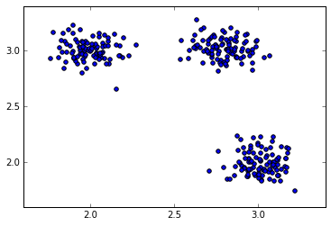
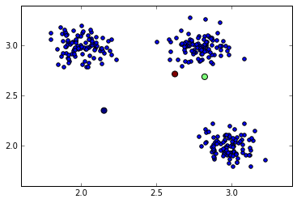
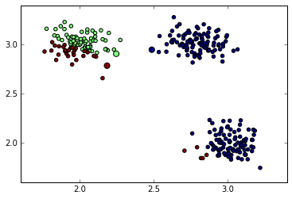
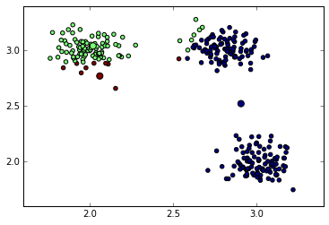

> ## Learning objectives {.objectives}
>
> After the lesson the learner should:
>
> * Be able to combine axis-based reductions, broadcasting and indexing to implement a simple clustering algorithm.
> * Understand what are the advantages of vectorisation and when to use or not use it.

K-means is a simple algorithm to cluster data -- that is to identify groups of similar objects based only on their properties. The algorithm is best-illustrated by the following graph.


### Loading data

We first need to load sample. If you haven't done some before you can download it from [here](data/kmeans_data.csv).

```
>>> data = np.loadtxt('kmeans_data.csv')
>>> data.shape
(30, 2)
```

To visualise the data we can use the `scatter` function from matplotlib package:

```
>>> import matplotlib.pyplot as plt
>>> plt.scatter(data[:, 0], data[:, 1], s=40)
>>> plt.show()
```



Since, we are going to build up the example gradually. Let us put the commands in a script:

```
import numpy as np
import matplotlib.pyplot as plt

# load data
data = np.loadtxt('kmeans_data.csv')

# plot
plt.scatter(data[:, 0], data[:, 1], s=40)
```


### Initialisation

In the first step of the algorithm we need to initialise the centers of the clusters. We will initialise them randomly but consistently with the mean and standard deviation of the data:


```python
K = 3
centroids = np.random.randn(K, 2)
```

To center the cluster centroids on the data it's better to normalise to the mean and standard deviation of the data:

```
centroids = centroids * np.std(data, 0)
centroids = centroids + np.mean(data, 0)
```


Let's now plot the data and the random cluster centers on the same figure:


```python
plt.scatter(data[:, 0], data[:, 1], s=40)
plt.scatter(centroids[:, 0], centroids[:, 1], c=np.arange(3), s=100)
```




### Assignment

> ## Find closest centers {.challenge}
>
> Calculate the Euclidean distance between all data points to each of the center and then find the index of the closest center. 

We now need to assign each point to the closest cluster center. First, we will calculate the Euclidean distance of each point to each of the centers. For this we can use the **broadcasting**:


```python
deltas = data[:, np.newaxis, :] - centroids
distances = np.sqrt(np.sum((deltas) ** 2, 2))
```

For each data point we find the center with minimum distance. We can use the `argmin` method with the **axis argument**:

```python
closest = distances.argmin(1)
```

Now we plot the centroids and data points with the color-code reflecting cluster membership:

```python
plt.scatter(data[:, 0], data[:, 1], s=40, c=closest)
plt.scatter(centroids[:, 0], centroids[:, 1], c=np.arange(3), s=100)
```



### Calculate new cluster centers

> ## Cluster center {.challenge}
>
> Given the array of cluster assignments (`closest_centers` returned by `assign` function) calculate the center coordinates of the first cluster cluster (index 0). 

To calculate new centers of the clusters, we average all points belonging to that cluster. We can use a **boolean mask**. For example, to calculate the center of a cluster 0 we will use the following instruction:


```python
data[closest_center==0, :].mean(0)
```

```
array([ 2.90695091,  2.52099101])
```

To repeat it for all clusters we can use a for loop or list comprehension. Since the number of clusters is usually much smaller than the number of data points, this for loop won't affect the performance of our algorithm:


```python
centroids = np.array([data[closest == i, :].mean(0) for i in range(3)])
```

Lets check the positions of new centers and assignment of points to clusters.




### Iterations

Now we can repeat the steps of assigning point to clusters and updating the cluster centers iteratively and watch the progress of the algorithm:


```python
for iteration in range(5):
   # assign points to clusters
   deltas = data[:, np.newaxis, :] - centroids
   distances = np.sqrt(np.sum((deltas) ** 2, 2))
   closest = distances.argmin(1)

   # calculate new centroids
   centroids = np.array([data[closest == i, :].mean(0) for i in range(3)])
```

> ## Single cluster? {.callout}
>
> Note that sometimes the algorithm can produce degenerate results -- all of the points will be assigned to a single cluster (or final number of clusters will be less than K). This is one of drawbacks of K-means with random initialisations. A possible solution is to repeat the algorithm with other initialisations and find the best cluster assignment, but better solutions exist.

### Putting it all together

Our final script will look as the following:

```python
import numpy as np
import matplotlib.pyplot as plt

data = np.loadtxt('kmeans_data.csv')

# randomly initalize the centroids
K = 3
centroids = np.random.randn(K, 2)
centroids = centroids * np.std(data, 0)
centroids = centroids + np.mean(data, 0)

for iteration in range(5):
   # assign points to clusters
   deltas = data[:, np.newaxis, :] - centroids
   distances = np.sqrt(np.sum((deltas) ** 2, 2))
   closest = distances.argmin(1)

   # calculate new centroids
   centroids = np.array([data[closest == i, :].mean(0) for i in range(3)])

# plot 
plt.scatter(data[:, 0], data[:, 1], s=40, c=closest)
plt.scatter(centroids[:, 0], centroids[:, 1], c=np.arange(3), s=100)

plt.show()
```

> ## Choice of K {.challenge}
>
> Check whether the algorithm works for any K. Try using K > 3. What happens then?

> ## Memory or speed {.challenge}
>
> Replace the assignment and calculation of new clusters with a for loop. Which implementation would be preferable for small (few observations and dimensions) and which for large datasets (large number of observations and dimensions).
